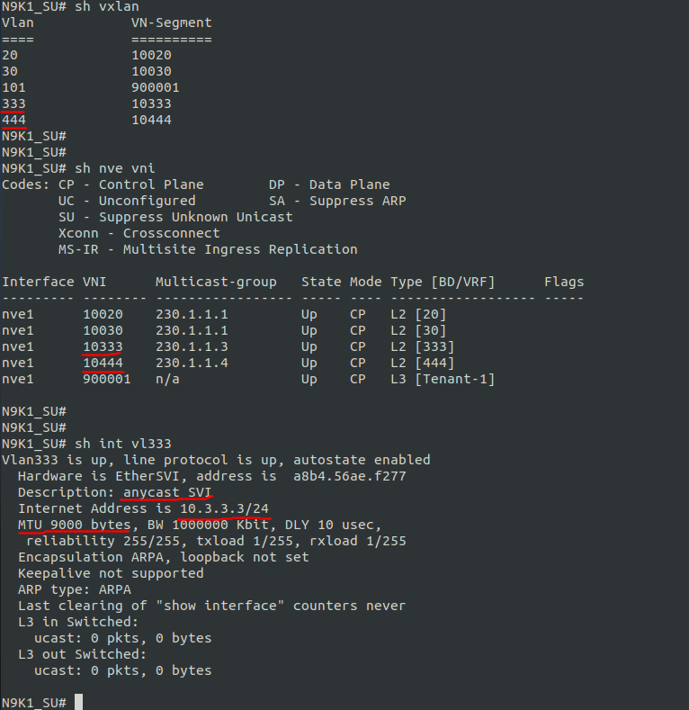

# Configuring Nexus switches via Netconf using scrapli_netconf
In this lab we'll be configuring vlans, SVI and l2vni (evpn) on Nexus swithces interacting with them by netconf protocol.  
As a netconf client we'll be using [scrapli_netconf](https://github.com/scrapli/scrapli_netconf) - a netconf driver built on top of scrapli

## Dependencies
pip3 install scrapli-netconf

## Note:
Please note that below scripts/libraries or configurations are for learning purposes only, do not use them in production environment.

## Introduction:
Netconf Protocol is described in [RFC6241](https://tools.ietf.org/html/rfc6241) provides mechanisms to install, manipulate, and delete the configuration of network devices

scrapli_netconf is a modern netconf client python library that helps us to interact with devices. The scrapli_netconf docs says it supports the following platforms: IOS-XE, IOS-XR and Junos. NXOS is not in the list but I've found out it does work pretty good with nexuses too

## the lab
The lab consists of two parts:  
1. configuring vlans and SVIs
2. configuring evpn l2vni (vlan, anycast svi, vtep interface, bgp evp section)

Netconf uses XML RPCs to interact with network devices. The structure of the RPCs is determined by YANG models that a given device is supported. But that is another topic. In this lab, the RPCs have already been prepared and carefully placed in the *tpl_evpn_xml.py* file as templates.

There are two classes in the *netcond_data_class.py* file, the purpose of which is to validate the input data, fill the templates and return RPCs ready for use

class **vlan_svi_data** works with Vlan and SVI data  
class **evpn_data works** works with l2vpn data  

each class has 3 public methods:
- **get_rpc_create()** - returns the RPC used to create the configuration
- **get_rpc_get()** - returns the RPC used in configuration requests
- **get_rpc_remove()** - returns an RPC that removes the config

## 1. configuring vlans and SVIs

In this part I've been using one of the Open NX-OS Sandboxes from Cisco.  
There several such sandboxes you can choose from. I ran into one of these sandboxes when I was taking the course [NETCONF/YANG on Nexus: Part 1 - Learning to use the Cisco NXOS YANG Model](https://developer.cisco.com/learning/lab/yang_devnet-format_part1/step/1)  
I hope Cisco won't mind if I use the same sandbox for my code.  
Here is a link to that very sandbox: [The "Open NX-OS Programmability" Always On Sandbox](https://devnetsandbox.cisco.com/RM/Diagram/Index/dae38dd8-e8ee-4d7c-a21c-6036bed7a804?diagramType=Topology)

And these are the connection options we'll be using to play with the sandbox:
```python
sandbox = {
    "host": "sbx-nxos-mgmt.cisco.com",
    "port": 10000,
    "auth_username": "admin",
    "auth_password": "Admin_1234!",
    "auth_strict_key": False,    
}
```

Lets create the Vlan with *vlan_id=2345* and SVI with ipv4 address *10.0.23.45/24*  
to do that we need to instatiate an object from **vlan_svi_data** class with the following args:

```python
vlan2345 = vlan_svi_data(2345, ip_address='10.0.23.45/24', vlan_name='VLAN2345', description='SVI by  Netconf')
```
As sandbox is a sandbox and we have no option to validate config via CLI we'll be validating it with netconf also.
thus that is going to be 4 steps:
1. creating the config
2. checking if the config would have been created
3. deleting the config
4. checking if the config is gone

```python
with NetconfScrape(**sandbox) as conn:
    print("************** creating the svi ******************")
    resp1 = config_scrapi_netconf(conn, vlan2345.get_rpc_create())
    print(resp1.result)

    print("*************** check the svi *********************")
    resp1 = get_scrapli_netconf(conn, vlan2345.get_rpc_get())
    print(resp1.result)

    print("************** deleting the svi *******************")
    resp1 = config_scrapi_netconf(conn, vlan2345.get_rpc_remove())
    print(resp1.result)

    print("*** check the svi are gone along with the vlan ****")
    resp1 = get_scrapli_netconf(conn, vlan2345.get_rpc_get())
    print(resp1.result)  

```

The code of this lab is placed in the jupyter-notebook *lab1.ipynb* for a convenience  
if you start it you'll get the follwing output

```xml
************** creating the svi ******************
<rpc-reply xmlns="urn:ietf:params:xml:ns:netconf:base:1.0" message-id="101">
  <ok/>
</rpc-reply>

*************** check the svi *********************
<rpc-reply xmlns="urn:ietf:params:xml:ns:netconf:base:1.0" message-id="102">
  <data>
    <System xmlns="http://cisco.com/ns/yang/cisco-nx-os-device">
      <bd-items>
        <bd-items>
          <BD-list>
            <fabEncap>vlan-2345</fabEncap>
            <BdState>active</BdState>
            <adminSt>active</adminSt>
            <bridgeMode>mac</bridgeMode>
            <fwdCtrl>mdst-flood</fwdCtrl>
            <fwdMode>bridge,route</fwdMode>
            <id>2345</id>
            <longName>false</longName>
            <macPacketClassify>disable</macPacketClassify>
            <mode>CE</mode>
            <name>VLAN2345</name>
            <operSt>down</operSt>
            <xConnect>disable</xConnect>
          </BD-list>
        </bd-items>
      </bd-items>
      <intf-items>
        <svi-items>
          <If-list>
            <id>vlan2345</id>
            <adminSt>up</adminSt>
            <autostate>true</autostate>
            <bw>1000000</bw>
            <carDel>100</carDel>
            <delay>1</delay>
            <descr>SVI by  Netconf</descr>
            <inbMgmt>false</inbMgmt>
            <iod>82</iod>
            <loadIntvl1>60</loadIntvl1>
            <loadIntvl2>300</loadIntvl2>
            <loadIntvl3>60</loadIntvl3>
            <mac>00:BB:2C:FC:1B:08</mac>
            <medium>bcast</medium>
            <mtu>1500</mtu>
            <mtuInherit>true</mtuInherit>
            <operSt>down</operSt>
            <operStQual>vlan-down</operStQual>
            <rtvrfMbr-items>
              <tDn>/System/inst-items/Inst-list[mode='default']</tDn>
            </rtvrfMbr-items>
            <snmpTrap>true</snmpTrap>
            <vlanId>2345</vlanId>
            <vlanT>bd-regular</vlanT>
          </If-list>
        </svi-items>
      </intf-items>
      <ipv4-items>
        <inst-items>
          <dom-items>
            <Dom-list>
              <name>default</name>
              <if-items>
                <If-list>
                  <id>vlan2345</id>
                  <addr-items>
                    <Addr-list>
                      <addr>10.0.23.45/24</addr>
                      <operSt>down</operSt>
                      <operStQual>unspecified</operStQual>
                      <pref>0</pref>
                      <tag>0</tag>
                      <type>primary</type>
                    </Addr-list>
                  </addr-items>
                  <directedBroadcast>disabled</directedBroadcast>
                  <dropGlean>disabled</dropGlean>
                  <forward>disabled</forward>
                  <operSt>up</operSt>
                  <operStQual>unspecified</operStQual>
                  <urpf>disabled</urpf>
                </If-list>
              </if-items>
            </Dom-list>
          </dom-items>
        </inst-items>
      </ipv4-items>
    </System>
  </data>
</rpc-reply>

************** deleting the svi *******************
<rpc-reply xmlns="urn:ietf:params:xml:ns:netconf:base:1.0" message-id="103">
  <ok/>
</rpc-reply>

*** check the svi are gone along with the vlan ****
<rpc-reply xmlns="urn:ietf:params:xml:ns:netconf:base:1.0" message-id="104">
  <data>
    <System xmlns="http://cisco.com/ns/yang/cisco-nx-os-device">
      <ipv4-items>
        <inst-items>
          <dom-items>
            <Dom-list>
              <name>default</name>
            </Dom-list>
          </dom-items>
        </inst-items>
      </ipv4-items>
    </System>
  </data>
</rpc-reply>
```

You can make sure the vlan and the SVI were successfully created ("check the svi" section), 
and then deleted :)

## 2. configuring evpn l2vni (vlan, anycast svi, vtep interface, bgp evp section)

This lab can't be run within the sandbox unfortunately. Evpn is not supported there.  
But I ran it over my own Nexus switch (93180EX, nxos v.9.3-5) and I can assure you it works.  

In this lab we'll be creating l2vni with anycast gateway with the following params:

| vlan_id | vni   | ip_address  | mtu  | multicast group |
|---------|-------|-------------|------|-----------------|
| 333     | 10333 | 10.3.3.3/24 | 9000 | 230.1.1.3       |
| 444     | 10444 | 10.4.4.4/24 | 1500 | 230.1.1.4       |

first make sure there are no such vlans on the switch 


now lets run code, look for the output and check the switch for the desired objects created

    python3 play_scraply_netconf.py

```xml
************** creating evpns ******************
resp1.result = '<rpc-reply xmlns="urn:ietf:params:xml:ns:netconf:base:1.0" message-id="101">\n  <ok/>\n</rpc-reply>\n'
resp2.result = '<rpc-reply xmlns="urn:ietf:params:xml:ns:netconf:base:1.0" message-id="102">\n  <ok/>\n</rpc-reply>\n'
*************** check evpns *********************
<rpc-reply xmlns="urn:ietf:params:xml:ns:netconf:base:1.0" message-id="103">
  <data>
    <System xmlns="http://cisco.com/ns/yang/cisco-nx-os-device">
      <bd-items>
        <bd-items>
          <BD-list>
            <fabEncap>vlan-333</fabEncap>
            <BdState>active</BdState>
            <accEncap>vxlan-10333</accEncap>
            <adminSt>active</adminSt>
            <bridgeMode>mac</bridgeMode>
            <dbgVlanStats-items>
              <inBcastOctets>0</inBcastOctets>
              <inBcastPkts>0</inBcastPkts>
              <inL3UcastOctets>0</inL3UcastOctets>
              <inL3UcastPkts>0</inL3UcastPkts>
              <inMcastOctets>0</inMcastOctets>
              <inMcastPkts>0</inMcastPkts>
              <inUcastOctets>0</inUcastOctets>
              <inUcastPkts>0</inUcastPkts>
              <outUcastOctets>0</outUcastOctets>
              <outUcastPkts>0</outUcastPkts>
            </dbgVlanStats-items>
            <fwdCtrl>mdst-flood</fwdCtrl>
            <fwdMode>bridge,route</fwdMode>
            <id>333</id>
            <longName>false</longName>
            <macPacketClassify>disable</macPacketClassify>
            <mode>CE</mode>
            <name>l2VNI-10333</name>
            <operSt>down</operSt>
            <xConnect>disable</xConnect>
          </BD-list>
        </bd-items>
      </bd-items>
      <intf-items>
        <svi-items>
          <If-list>
            <id>vlan333</id>
            <adminSt>up</adminSt>
            <autostate>true</autostate>
            <bw>1000000</bw>
            <carDel>100</carDel>
            <delay>1</delay>
            <descr>anycast SVI</descr>
            <inbMgmt>false</inbMgmt>
            <iod>5</iod>
            <loadIntvl1>60</loadIntvl1>
            <loadIntvl2>300</loadIntvl2>
            <loadIntvl3>60</loadIntvl3>
            <medium>bcast</medium>
            <mtu>9000</mtu>
            <mtuInherit>true</mtuInherit>
            <operSt>up</operSt>
            <operStQual>unknown</operStQual>
            <rtvrfMbr-items>
              <tDn>/System/inst-items/Inst-list[name='Tenant-1']</tDn>
            </rtvrfMbr-items>
            <snmpTrap>true</snmpTrap>
            <svi-items>
              <adminSt>up</adminSt>
              <ifIndex>151060813</ifIndex>
              <iod>5</iod>
              <operAutoState>true</operAutoState>
              <operBw>1000000</operBw>
              <operCarrierDelayMsec>100</operCarrierDelayMsec>
              <operCarrierDelaySec>0</operCarrierDelaySec>
              <operDelay>1</operDelay>
              <operDescr>anycast SVI</operDescr>
              <operLastChgSec>1605100451</operLastChgSec>
              <operLastChgUsec>2882</operLastChgUsec>
              <operLoadIntvl1>60</operLoadIntvl1>
              <operLoadIntvl2>300</operLoadIntvl2>
              <operLoadIntvl3>60</operLoadIntvl3>
              <operMac>A8:B4:56:AE:F2:77</operMac>
              <operMtu>9000</operMtu>
              <operStQual>unknown</operStQual>
            </svi-items>
            <vlanId>333</vlanId>
            <vlanT>bd-regular</vlanT>
          </If-list>
        </svi-items>
      </intf-items>
      <ipv4-items>
        <inst-items>
          <dom-items>
            <Dom-list>
              <name>Tenant-1</name>
              <if-items>
                <If-list>
                  <id>vlan333</id>
                  <addr-items>
                    <Addr-list>
                      <addr>10.3.3.3/24</addr>
                      <operSt>up</operSt>
                      <operStQual>unspecified</operStQual>
                      <pref>0</pref>
                      <tag>0</tag>
                      <type>primary</type>
                    </Addr-list>
                  </addr-items>
                  <directedBroadcast>disabled</directedBroadcast>
                  <dropGlean>disabled</dropGlean>
                  <forward>disabled</forward>
                  <operSt>up</operSt>
                  <operStQual>unspecified</operStQual>
                  <urpf>disabled</urpf>
                </If-list>
              </if-items>
            </Dom-list>
          </dom-items>
        </inst-items>
      </ipv4-items>
      <eps-items>
        <epId-items>
          <Ep-list>
            <epId>1</epId>
            <nws-items>
              <vni-items>
                <Nw-list>
                  <vni>10333</vni>
                  <associateVrfFlag>false</associateVrfFlag>
                  <isLegacyMode>false</isLegacyMode>
                  <mcastGroup>230.1.1.3</mcastGroup>
                  <multisiteIngRepl>disable</multisiteIngRepl>
                  <spineAnyCastGw>false</spineAnyCastGw>
                  <suppressARP>off</suppressARP>
                </Nw-list>
              </vni-items>
            </nws-items>
          </Ep-list>
        </epId-items>
      </eps-items>
      <evpn-items>
        <bdevi-items>
          <BDEvi-list>
            <encap>vxlan-10333</encap>
            <operRd>rd:ipv4-nn2:1.1.1.1:33100</operRd>
            <rd>rd:unknown:0:0</rd>
            <rttp-items>
              <RttP-list>
                <type>import</type>
                <ent-items>
                  <RttEntry-list>
                    <rtt>route-target:unknown:0:0</rtt>
                  </RttEntry-list>
                </ent-items>
              </RttP-list>
              <RttP-list>
                <type>export</type>
                <ent-items>
                  <RttEntry-list>
                    <rtt>route-target:unknown:0:0</rtt>
                  </RttEntry-list>
                </ent-items>
              </RttP-list>
            </rttp-items>
            <tblMapFltr>false</tblMapFltr>
          </BDEvi-list>
        </bdevi-items>
      </evpn-items>
    </System>
  </data>
</rpc-reply>
 <rpc-reply xmlns="urn:ietf:params:xml:ns:netconf:base:1.0" message-id="104">
  <data>
    <System xmlns="http://cisco.com/ns/yang/cisco-nx-os-device">
      <bd-items>
        <bd-items>
          <BD-list>
            <fabEncap>vlan-444</fabEncap>
            <BdState>active</BdState>
            <accEncap>vxlan-10444</accEncap>
            <adminSt>active</adminSt>
            <bridgeMode>mac</bridgeMode>
            <dbgVlanStats-items>
              <inBcastOctets>0</inBcastOctets>
              <inBcastPkts>0</inBcastPkts>
              <inL3UcastOctets>0</inL3UcastOctets>
              <inL3UcastPkts>0</inL3UcastPkts>
              <inMcastOctets>0</inMcastOctets>
              <inMcastPkts>0</inMcastPkts>
              <inUcastOctets>0</inUcastOctets>
              <inUcastPkts>0</inUcastPkts>
              <outUcastOctets>0</outUcastOctets>
              <outUcastPkts>0</outUcastPkts>
            </dbgVlanStats-items>
            <fwdCtrl>mdst-flood</fwdCtrl>
            <fwdMode>bridge,route</fwdMode>
            <id>444</id>
            <longName>false</longName>
            <macPacketClassify>disable</macPacketClassify>
            <mode>CE</mode>
            <name>l2VNI-10444</name>
            <operSt>down</operSt>
            <xConnect>disable</xConnect>
          </BD-list>
        </bd-items>
      </bd-items>
      <intf-items>
        <svi-items>
          <If-list>
            <id>vlan444</id>
            <adminSt>up</adminSt>
            <autostate>true</autostate>
            <bw>1000000</bw>
            <carDel>100</carDel>
            <delay>1</delay>
            <descr>anycast SVI (by netconf)</descr>
            <inbMgmt>false</inbMgmt>
            <iod>6</iod>
            <loadIntvl1>60</loadIntvl1>
            <loadIntvl2>300</loadIntvl2>
            <loadIntvl3>60</loadIntvl3>
            <medium>bcast</medium>
            <mtu>1500</mtu>
            <mtuInherit>true</mtuInherit>
            <operSt>up</operSt>
            <operStQual>unknown</operStQual>
            <rtvrfMbr-items>
              <tDn>/System/inst-items/Inst-list[name='Tenant-1']</tDn>
            </rtvrfMbr-items>
            <snmpTrap>true</snmpTrap>
            <svi-items>
              <adminSt>up</adminSt>
              <ifIndex>151060924</ifIndex>
              <iod>6</iod>
              <operAutoState>true</operAutoState>
              <operBw>1000000</operBw>
              <operCarrierDelayMsec>100</operCarrierDelayMsec>
              <operCarrierDelaySec>0</operCarrierDelaySec>
              <operDelay>1</operDelay>
              <operDescr>anycast SVI (by netconf)</operDescr>
              <operLastChgSec>1605100451</operLastChgSec>
              <operLastChgUsec>111090</operLastChgUsec>
              <operLoadIntvl1>60</operLoadIntvl1>
              <operLoadIntvl2>300</operLoadIntvl2>
              <operLoadIntvl3>60</operLoadIntvl3>
              <operMac>A8:B4:56:AE:F2:77</operMac>
              <operMtu>1500</operMtu>
              <operStQual>unknown</operStQual>
            </svi-items>
            <vlanId>444</vlanId>
            <vlanT>bd-regular</vlanT>
          </If-list>
        </svi-items>
      </intf-items>
      <ipv4-items>
        <inst-items>
          <dom-items>
            <Dom-list>
              <name>Tenant-1</name>
              <if-items>
                <If-list>
                  <id>vlan444</id>
                  <addr-items>
                    <Addr-list>
                      <addr>10.4.4.4/24</addr>
                      <operSt>up</operSt>
                      <operStQual>unspecified</operStQual>
                      <pref>0</pref>
                      <tag>0</tag>
                      <type>primary</type>
                    </Addr-list>
                  </addr-items>
                  <directedBroadcast>disabled</directedBroadcast>
                  <dropGlean>disabled</dropGlean>
                  <forward>disabled</forward>
                  <operSt>up</operSt>
                  <operStQual>unspecified</operStQual>
                  <urpf>disabled</urpf>
                </If-list>
              </if-items>
            </Dom-list>
          </dom-items>
        </inst-items>
      </ipv4-items>
      <eps-items>
        <epId-items>
          <Ep-list>
            <epId>1</epId>
            <nws-items>
              <vni-items>
                <Nw-list>
                  <vni>10444</vni>
                  <associateVrfFlag>false</associateVrfFlag>
                  <isLegacyMode>false</isLegacyMode>
                  <mcastGroup>230.1.1.4</mcastGroup>
                  <multisiteIngRepl>disable</multisiteIngRepl>
                  <spineAnyCastGw>false</spineAnyCastGw>
                  <suppressARP>off</suppressARP>
                </Nw-list>
              </vni-items>
            </nws-items>
          </Ep-list>
        </epId-items>
      </eps-items>
      <evpn-items>
        <bdevi-items>
          <BDEvi-list>
            <encap>vxlan-10444</encap>
            <operRd>rd:ipv4-nn2:1.1.1.1:33211</operRd>
            <rd>rd:unknown:0:0</rd>
            <rttp-items>
              <RttP-list>
                <type>import</type>
                <ent-items>
                  <RttEntry-list>
                    <rtt>route-target:unknown:0:0</rtt>
                  </RttEntry-list>
                </ent-items>
              </RttP-list>
              <RttP-list>
                <type>export</type>
                <ent-items>
                  <RttEntry-list>
                    <rtt>route-target:unknown:0:0</rtt>
                  </RttEntry-list>
                </ent-items>
              </RttP-list>
            </rttp-items>
            <tblMapFltr>false</tblMapFltr>
          </BDEvi-list>
        </bdevi-items>
      </evpn-items>
    </System>
  </data>
</rpc-reply>

> /home/nryzhkov/nexus_scrapli_netconf_lab/play_scraply_netconf.py(69)<module>()
-> print("************** deleting evpns *******************")
(Pdb) 
```

Note **(Pdb)** in the last line?  
This is a magic trick done by a built-in python function breackpoint()  
I'm using it to pause my program in the certain place  

So at this point the program would have to create two evpns.  
Let's check it out:

  

  

Ok. evpns are created. Now unpausing the program by typing *continue* in the terminal

```xml
(Pdb) continue
************** deleting evpns *******************
resp1.result = '<rpc-reply xmlns="urn:ietf:params:xml:ns:netconf:base:1.0" message-id="105">\n  <ok/>\n</rpc-reply>\n'
resp2.result = '<rpc-reply xmlns="urn:ietf:params:xml:ns:netconf:base:1.0" message-id="106">\n  <ok/>\n</rpc-reply>\n'
*********** check evpns are gone *****************
<rpc-reply xmlns="urn:ietf:params:xml:ns:netconf:base:1.0" message-id="107">
  <data>
    <System xmlns="http://cisco.com/ns/yang/cisco-nx-os-device">
      <ipv4-items>
        <inst-items>
          <dom-items>
            <Dom-list>
              <name>Tenant-1</name>
            </Dom-list>
          </dom-items>
        </inst-items>
      </ipv4-items>
      <eps-items>
        <epId-items>
          <Ep-list>
            <epId>1</epId>
          </Ep-list>
        </epId-items>
      </eps-items>
    </System>
  </data>
</rpc-reply>
 <rpc-reply xmlns="urn:ietf:params:xml:ns:netconf:base:1.0" message-id="108">
  <data>
    <System xmlns="http://cisco.com/ns/yang/cisco-nx-os-device">
      <ipv4-items>
        <inst-items>
          <dom-items>
            <Dom-list>
              <name>Tenant-1</name>
            </Dom-list>
          </dom-items>
        </inst-items>
      </ipv4-items>
      <eps-items>
        <epId-items>
          <Ep-list>
            <epId>1</epId>
          </Ep-list>
        </epId-items>
      </eps-items>
    </System>
  </data>
</rpc-reply>
```
And now checking for our evpns again  


Yes, our evpn`s are disappeared as expected

that's it

----
## How to Use:

Install scrapli_netconf

    pip3 install scraply-netconf

Clone the repo  

    git clone https://github.com/IDQDD/nexus_scraply_netconf_lab

cd into the directory

    cd nexus_scraply_netconf_lab

Run the script by typing 
    
    python3 play_scraply_netconf.py

or you can play with the cisco nexus sandbox via jupyter-notebook (*lab1.ipynb*)  
btw: vscode supports notebooks natively. I found it quite handy

## About me

My name is Nikolay Ryzhkov - enterprise network engineer, automation enthusiast, pythonista

## Contact

[twitter](https://twitter.com/iddqd__)